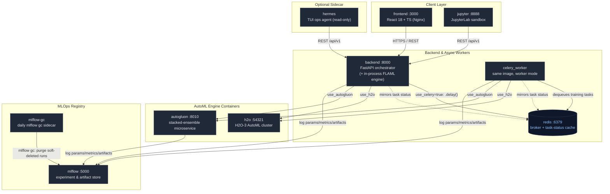

# Decisera — AI Decision Intelligence Platform

> **Enterprise-grade machine learning and decision intelligence platform that automates tabular ML workflows, generates explainable SHAP insights, and provides an AI Copilot for natural language dataset exploration.**

[](https://github.com/josephkamau32/AI-Decision-Intelligence-System/actions/workflows/ci.yml)
[](LICENSE)
[](https://decisera.vercel.app)
[](https://www.python.org/downloads/)
[](https://reactjs.org/)
[](https://www.typescriptlang.org/)
[](docker-compose.yml)

---

## 🌐 Live Demo

Experience the platform live in production:

🔗 **[https://decisera.vercel.app](https://decisera.vercel.app)**

> **⚡ Cold Start Notice:** The backend is deployed on Render's free tier and automatically suspends when idle. If the instance is sleeping, the first API request or page load may take up to **~50 seconds** to boot; the frontend displays a real-time status banner while waiting. Subsequent requests execute with sub-second response times.

### Demo Access & Authentication
- **Self-Registration Enabled:** Anyone can create an account immediately. Navigate to the [Registration Page](https://decisera.vercel.app/register) or click **"Get Started Free"** on the landing page to register your credentials. No administrator pre-approval is required.
- **Pre-configured Demo Workspace:** Once registered and logged in, you can instantly upload sample CSV datasets, trigger automated model training, evaluate SHAP explainability charts, or converse with the AI Copilot.

---

## 📸 Platform Tour

Real, unedited screenshots from the running application:

### 1. Landing & Navigation
Modern, accessible landing page presenting the core value proposition, architecture summary, and real-time backend health diagnostics.


---

### 2. Analytics Dashboard
Central command center tracking total datasets, active models, prediction metrics, automated data quality profiling, and recent ML runs.


---

### 3. Automated Model Performance & Evaluation
Multi-model benchmarking engine evaluating 12+ algorithms across classification, regression, and time-series tasks with interactive metrics and confusion matrices.


---

### 4. Explainable AI & SHAP Feature Attribution
TreeSHAP and KernelSHAP visualizer uncovering global feature importance rankings, decision thresholds, and per-feature impact directions.


---

## 🏗️ Architecture Overview

Decisera follows a **Microservices-based MLOps & Decision Intelligence Architecture** designed for high throughput, asynchronous model training, decoupled storage, and explainability.

```
┌─────────────────────────────────────────────────────────────┐
│                    User Interface Layer                     │
│   Frontend (React 18 + TS)        │   JupyterLab Sandbox    │
│   (Precision Foundry Design)      │   (Interactive Inferences)│
└──────────────┬───────────────────────────────┬──────────────┘
               │ HTTPS / REST                  │ Direct / REST Inferences
               ▼                               ▼
┌─────────────────────────────────────────────────────────────┐
│               Backend: FastAPI (Orchestrator)               │
│  - Pydantic v2 schemas & strict type validation             │
│  - JWT Bearer Authentication & PBKDF2 / Bcrypt hashing      │
│  - Presentation / API Routing Layer (`backend/api/`)         │
│  - Service & Business Logic Layer (`backend/services/`)     │
│  - Triple AutoML engines: H2O cluster, in-process FLAML &   │
│    AutoGluon microservice                                    │
│  - Selectable execution mode per /train request:             │
│    in-process (FastAPI BackgroundTasks) or Celery worker    │
└──────────────┬───────────────────────────────┬──────────────┘
               │ Queues Tasks (use_celery=true) │ Tracks Models & Runs
               ▼                               ▼
┌────────────────────────────┐    ┌───────────────────────────┐
│     MLOps Worker Layer     │    │      Model Registry       │
│  celery_worker + Redis     │    │       MLflow Server       │
│  - Dedicated worker         │    │  - Experiment Lineage     │
│    container/process        │    │  - Model Artifact Store   │
│  - Delegates to the same    │    │                            │
│    model_service training   │    │                            │
│    path as the in-process   │    │                            │
│    mode (single source of   │    │                            │
│    truth for AutoML fit)    │    │                            │
│  - Async AutoML & Tuning   │    │                            │
│  - Batch Inferences        │    │                            │
└──────────────┬─────────────┘    └────────────┬──────────────┘
               │                               │
               └───────────────┬───────────────┘
                               ▼
┌─────────────────────────────────────────────────────────────┐
│             Persistence & Shared Volume Layer               │
│  • models_data: Serialized .joblib estimators & pipelines   │
│  • storage_data: SQLite (decisera.db) / PostgreSQL metadata │
│  • uploads & mlflow_data: Datasets & Experiment artifacts   │
│  • Redis: also mirrors task status, so both the API process │
│    and celery_worker can serve GET /tasks/{id}/status       │
└─────────────────────────────────────────────────────────────┘

┌─────────────────────────────────────────────────────────────┐
│                Hermes Agent Sidecar (optional)               │
│  Long-running TUI/agent container with read access to the   │
│  backend's uploads & models volumes, talking to the backend │
│  API and MLflow over the internal Docker network.            │
└─────────────────────────────────────────────────────────────┘
```

### Architectural Pillars

1. **High-Level Paradigm — Containerized Microservices / SOA:**
   - **Frontend SPA (React 18 + TypeScript):** Hosted on Vercel Edge. Employs the bespoke *Precision Foundry* tokenized design system (Obsidian dark palette, Lucide icons, responsive sidebar rail).
   - **Backend API (FastAPI + Python 3.11):** High-performance async gateway handling data ingestion, model management, predictions, and health/monitoring.
   - **Interactive Exploration (JupyterLab):** Dedicated data science container with direct access to dataset directories, models, and live REST endpoints for custom scenario simulations.

2. **Backend Design — Layered (N-Tier) Architecture:**
   - **Presentation / API Layer (`backend/api/`):** FastAPI routers validating requests, handling auth, and serializing responses.
   - **Service / Business Logic Layer (`backend/services/`):** Orchestrates domain workflows (`model_service.py`, `dataset_service.py`, `insights_service.py`).
   - **Domain / ML Pipeline Layer (`backend/ml/`):** Data profiling, automated cleaning, AutoML model training, Optuna hyperparameter optimization, and TreeSHAP/KernelSHAP explainability.
   - **Data Access & Storage Layer (`backend/utils/storage.py`):** SQLAlchemy ORM managing SQLite/PostgreSQL persistence.

3. **Execution Pattern — Selectable Asynchronous Task-Worker Architecture:**
   - Training requests carry a `use_celery` flag: by default they run **in-process** via FastAPI `BackgroundTasks` (no extra container needed); when set, they're dispatched with `.delay()` to a dedicated **`celery_worker`** container/process backed by **Redis**.
   - Both execution modes converge on the same `model_service.train_model_async` code path, so there is exactly one implementation of data prep, AutoML fitting, explainability, and model persistence regardless of where it runs.
   - Task status is mirrored to Redis on every update, so `GET /tasks/{id}/status` on the API process can see progress written by a separate `celery_worker` process, not just tasks it ran itself.
   - Endpoints immediately return `202 Accepted` with a `task_id`, allowing non-blocking progress polling and maintaining low latency for real-time traffic.

4. **MLOps Pattern — Decoupled Model Storage & Lifecycle Management:**
   - **Binary Storage (`models_data`):** Serialized `.joblib` pipelines, estimators, and SHAP background samples are stored on persistent disk volumes (`/app/models`).
   - **Metadata Registry (`storage_data`):** Model scores, task types, target columns, and feature schemas are saved in SQL storage.
   - **Experiment Lineage (MLflow):** Metrics, parameters, and artifact versions are tracked at `http://localhost:5000`.

5. **AI Pattern — ReAct / Tool-Augmented AI Copilot (RAG):**
   - The AI Copilot (`backend/copilot/`) functions as an autonomous tool-calling agent. It inspects datasets, runs statistical tools, retrieves domain context via RAG, and generates plain-language business recommendations.

6. **AutoML Engine Selection — H2O vs. FLAML vs. AutoGluon:**
   - Decisera supports three interchangeable AutoML backends selectable per training request: the **H2O** cluster (`backend/ml/h2o_engine.py`), an in-process **FLAML** engine, and the **AutoGluon** microservice (`autogluon/`, deep multi-layer stack ensembling), with automatic fallback to scikit-learn when none are requested or available.
   - This keeps training available even when the H2O Java process is unhealthy or a given engine's container can't run in the deployment target, at the cost of FLAML/sklearn generally searching a narrower model space than H2O's or AutoGluon's cluster/ensemble-backed AutoML.

7. **Optional Agent Sidecar — Hermes:**
   - An optional `hermes` container runs a long-lived TUI-based coding/ops agent alongside the stack, with read access to the `uploads` and `models` volumes and network access to the backend API and MLflow — useful for interactively inspecting or operating on the running deployment without a separate host shell.

---

## 💻 Local Setup & Development

Follow these verified steps to run the complete stack locally from source.

### Prerequisites
- **Python 3.11+**
- **Node.js 18+** & npm
- **Git**
- Optional: **Docker** & **Docker Compose**

### 1. Clone the Repository
```bash
git clone https://github.com/josephkamau32/AI-Decision-Intelligence-System.git
cd AI-Decision-Intelligence-System
```

### 2. Backend Setup
```bash
# Create and activate virtual environment
python -m venv .venv

# On Windows:
.venv\Scripts\activate
# On Linux / macOS:
source .venv/bin/activate

# Install production dependencies
pip install -r requirements.txt

# (Optional) Install development and testing dependencies:
pip install -r requirements-dev.txt

# Create local environment file from template
cp .env.example .env

# Configure required keys in .env:
# - SECRET_KEY & JWT_SECRET_KEY (generate via: python -c "import secrets; print(secrets.token_urlsafe(32))")
# - ANTHROPIC_API_KEY (optional, for Claude AI Copilot)
# - ALLOWED_ORIGINS="http://localhost:3000,http://127.0.0.1:3000"

# Launch FastAPI backend with hot-reload
uvicorn backend.api.main:app --reload --port 8000
```
- Backend API: `http://localhost:8000`
- Swagger Interactive Docs: `http://localhost:8000/docs`
- Health Endpoint: `http://localhost:8000/api/v1/health`
- Prometheus Metrics: `http://localhost:8000/metrics`

### 3. Frontend Setup
```bash
# In a new terminal window
cd frontend

# Install npm dependencies
npm install --legacy-peer-deps

# Create local environment configuration
cp .env.example .env
# Verify REACT_APP_API_URL is set:
# REACT_APP_API_URL=http://localhost:8000

# Start React development server
npm start
```
- Web Application: `http://localhost:3000`

---

## 🐳 Docker Deployment (End-to-End Verified)

The entire Decisera platform is containerized and verified to run end-to-end via Docker Compose.

```bash
# From project root:
docker compose up --build -d
```

### Container Topology

All 10 services below are defined in [`docker-compose.yml`](docker-compose.yml). Solid arrows are live HTTP/REST calls between containers; dashed arrows are the Redis task-status mirror that lets both `backend` and `celery_worker` answer `GET /tasks/{id}/status` regardless of which process ran the job.



Not pictured to keep the diagram legible: seven named volumes (`uploads`, `models_data`, `storage_data`, `mlflow_data`, `redis_data`, `h2o_data`, `hermes_data`) shared read/write across `backend`, `celery_worker`, `h2o`, `autogluon`, `jupyter`, and read-only by `hermes` — see the `volumes:` blocks in [`docker-compose.yml`](docker-compose.yml) for the exact mapping per service.

### Verified Container Network & Ports
| Container | Image Tag | Host Port | Health Check |
|:---|:---|:---|:---|
| `backend` | `ai-decision-backend:latest` | `8000` | `curl -f http://localhost:8000/api/v1/health` (HTTP 200) |
| `celery_worker` | `ai-decision-backend:latest` | — | Consumes training tasks from Redis (`use_celery=true` on `/train`); no worker running means those tasks queue but never execute |
| `frontend` | `ai-decision-frontend:latest` | `3000` | Nginx Static Server + Internal Network Routing |
| `redis` | `redis:alpine` | `6379` | `redis-cli ping` (PONG) |
| `h2o` | `h2oai/h2o-open-source-k8s:3.46.0.1` | `54321` | `curl -f http://localhost:54321/3/About` (HTTP 200) |
| `autogluon` | `ai-decision-autogluon:latest` | `8010` | `curl -f http://localhost:8010/health` (HTTP 200) |
| `mlflow` | `ghcr.io/mlflow/mlflow:v3.16.0` | `5000` | Artifact & Experiment Registry |
| `mlflow-gc` | `ghcr.io/mlflow/mlflow:v3.16.0` | — | No HTTP surface; runs `mlflow gc` against the shared `mlflow_data` volume once a day to reclaim soft-deleted runs |
| `jupyter` | `ai-decision-jupyter:latest` | `8888` | JupyterLab sandbox with the same volumes as `backend`, for interactive notebook work |
| `hermes` | `ai-decision-hermes:latest` | — | Optional long-running agent sidecar with read-only access to `uploads`/`models` volumes |

### Verifying Container Health
```bash
# Check backend health from host:
curl -i http://localhost:8000/api/v1/health

# Verify frontend can communicate with backend inside the Docker network:
docker exec aidecisionintelligencesystem-frontend-1 wget -qO- http://backend:8000/api/v1/health
# Output: {"status":"healthy","version":"1.0.0","timestamp":"..."}
```

---

## 🧠 Engineering Notes & Tradeoffs

> *A transparent technical retrospective on architectural choices, tradeoffs, and production evolution.*

1. **Serverless Free-Tier Cold Starts vs. Dedicated Instances:**
   Deploying the backend on Render's free tier provides a cost-free continuous live demo, but incurs a ~50-second container spin-up penalty when cold. Heavy ML frameworks (PyTorch, scikit-learn, XGBoost, CatBoost, SHAP) require substantial import time and memory allocation during process initialization. Rather than disguising this delay, we engineered an asynchronous health-probing client in React with a transparent countdown alert. In an enterprise environment, we would separate the lightweight REST gateway (FastAPI on AWS Lambda / Cloud Run with provisioned concurrency) from a dedicated worker cluster (Celery / Ray on Kubernetes) to guarantee consistent sub-100ms API responses.

2. **Model Explainability: Precision vs. Computational Complexity:**
   We prioritized TreeSHAP for tree-based estimators (XGBoost, LightGBM, RandomForest) because it provides exact polynomial-time Shapley values for tabular decision trees. However, for neural architectures (LSTM) and arbitrary ensembles, KernelSHAP scales exponentially with feature dimension. To keep the interactive UI responsive under real-time constraints, we implemented background sampling approximations (median background clustering). With additional engineering time, we would implement asynchronous SHAP calculation jobs that stream attribution plots via WebSockets.

3. **Data Ingestion Robustness:**
   In early iterations, datasets containing mixed datetime strings, unencoded categorical levels, and high-cardinality ID columns caused pipeline failures. We redesigned `backend/ml/automl.py` with an automated preprocessing pipeline that enforces median numerical imputation, one-hot encoding for low-cardinality categoricals, datetime decomposition (year/month/day/hour), and automatic dropping of constant/ID columns before matrix hand-off to estimators.

4. **Persistent Database vs. Ephemeral Container Storage:**
   Render's free web services run on ephemeral containers that discard local disk files upon every deployment, manual redeploy, or idle spin-down. To ensure user accounts and credentials persist across redeploys, Decisera integrates with PostgreSQL via SQLAlchemy and `psycopg2-binary`, falling back to local SQLite in development. Note: Render's free PostgreSQL tier automatically expires 90 days after creation (provisioned September 5, 2026; expires December 4, 2026 unless upgraded to a paid persistent tier).

---

## 🧪 Testing & Quality Assurance

All commits are continuously validated via GitHub Actions on Ubuntu runners.

### Backend Test Suite
```bash
# Execute unit and integration tests
pytest -v

# Run with test coverage report
pytest -v --cov=backend/api --cov=backend/ml --cov=backend/services
```
*58 unit and integration tests passing with 0 errors across datasets, models, copilot mocking, persistent database storage, and data preprocessing.*

### Code Quality & Linters
```bash
# Black formatting check (88 character limit)
black --check backend/

# Flake8 style verification
flake8 backend/ --max-line-length=88 --extend-ignore=E203,W503

# Frontend TypeScript verification
cd frontend && npx tsc --noEmit
```

---

## 🔐 Security & RBAC

- **JWT Token Authentication:** Encrypted Bearer tokens with 30-minute expiration windows.
- **Password Security:** Cryptographic password hashing utilizing Bcrypt.
- **Role-Based Access Control:** Pre-configured roles (`Admin`, `User`, `Viewer`) restricting model deployment and dataset deletion permissions.
- **API Defense-in-Depth:** Configurable CORS origin whitelisting, HTTP security headers (HSTS, X-Frame-Options DENY, X-Content-Type-Options nosniff), and Pydantic v2 input sanitization.

---

## 📄 License

Distributed under the **MIT License**. See [`LICENSE`](LICENSE) for full details.

Copyright © 2026 **Joseph Kamau** ([@josephkamau32](https://github.com/josephkamau32)).